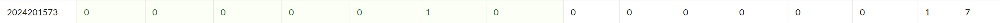

# bomblab 报告

姓名：罗翌宁

学号：2024201573

| 总分 | phase_1 | phase_2 | phase_3 | phase_4 | phase_5 | phase_6 | secret_phase |
| --------- | ------------- | ------------- | ------------- | ----------------- |-----------|-----------|-----------|
| 3        | 1            | 1            | 1            | 0 |0  |0  |0  |


scoreboard 截图：



<!-- TODO: 用一个scoreboard的截图，本地图片，放到 imgs 文件夹下，不要用这个 github，pandoc 解析可能有问题 -->

## 解题报告

<!-- 对你拆掉的每个phase进行分析，并写出你得出答案的历程 -->

<!-- 如果能用伪代码还原题目源代码最佳（不属于先前提到的大段代码），语言描述自己的分析也可，每道题目的图片不建议超过两张 -->

### phase_1

```c
A fading Light awaits two in a closed world of forgotten Conflict.
```

讲解题目思路

通过读汇编我们不难发现，
```c
0000000000001435 <phase_1>:
  1435: sub    $0x8,%rsp
  1439: lea    0x1d40(%rip),%rsi    # 3180  
  1440: call   strings_not_equal
  1445: test   %eax,%eax
  1447: jne    144e   
  1449: add    $0x8,%rsp
  144d: ret         
  144e: call   explode_bomb
  1453: jmp    1449
```

这里进行的是将0x1d40＋%rip传入%rsi，并传入strings_not_equal与我们输入的字符串进行对比，所以我们只需要找到0x1d40＋%rip处存储的字符串就可以了

运行时rip会指向 1440: call   strings_not_equal，在Layout里面可以看到这一行的地址是0x0x55555555440

所以最后传入strings_not_equal的地址就是0x55555555440+0x1d40=0x555555557180

所以我们直接在运行时用x/s0x555555557180这个地址存储的字符串就可以找到答案

### phase_2


讲解题目思路

首先来看一下这个题目要求的输入：    
```c    
    1464:	48 89 44 24 28       	mov    %rax,0x28(%rsp)
    1469:	31 c0                	xor    %eax,%eax
    146b:	48 89 e2             	mov    %rsp,%rdx
    146e:	48 8d 4c 24 04       	lea    0x4(%rsp),%rcx
    1473:	4c 8d 4c 24 0c       	lea    0xc(%rsp),%r9
    1478:	4c 8d 44 24 08       	lea    0x8(%rsp),%r8
    147d:	48 8d 35 6d 21 00 00 	lea    0x216d(%rip),%rsi        # 35f1 <array.0+0x391>
    1484:	e8 c7 fc ff ff       	call   1150 <__isoc99_sscanf@plt>
    1489:	83 f8 04             	cmp    $0x4,%eax
```

这里调用了__isoc99_sscanf@plt，上面的上面的4行说明我们要把函数的参数分别输入到%rsp，0x4(%rsp)，0x8(%rsp)，0xc(%rsp)，而下面的判断sscanf函数返回值是否等于4也说明了我们理论上应该需要输入4个整数

下面我们来寻找输入的4个整数应该是多少

```c
   <phase_2+0x4d> 
    148e:   48 8d 3d ab 4c 00 00    lea    0x4cab(%rip),%rdi # 6140 <matA.3> 
    1495:   48 8d 5c 24 10          lea    0x10(%rsp),%rbx 
    149a:   41 bb 00 00 00 00       mov    $0x0,%r11d 
    14a0:   eb 19                   jmp    14bb 
```
这段代码将0x4cab+%rip存入了rdi,通过注释我们知道这里应该是指向了一个matA矩阵的起始地址。rbx = rsp + 0x10可间是为存放最后的输出结果预留出了一段栈上的空间。

而后就进入了我们整个代码的主题部分，即计算对应的四个数字的主题循环部分。
```c
    14a9:   41 83 c3 01             add    $0x1,%r11d 
    14ad:   48 83 c7 0c             add    $0xc,%rdi 
    14b1:   48 83 c3 08             add    $0x8,%rbx 
    14b5:   41 83 fb 02             cmp    $0x2,%r11d
```
这里对应的是循环的外层，每次循环对%r11d＋1，对%rdi＋0xc，我们之前已经知道rdi存储的是matA，所以就是每次对matA往右移动12个字节也就是对matA的索引＋3；%rbx＋8则是说明会往后移动8个字节，也就是2个int，也就是说明一次循环内要计算2个int，最后的cmp告诉我们这个循环要进行两次

接下来进行内层循环，内层循环用%r8d计数，更内层的用了一个rax来记录在数组中计算到第几个了

```c
    14d8:	8b 14 87             	mov    (%rdi,%rax,4),%edx
    14db:	0f af 14 c6          	imul   (%rsi,%rax,8),%edx
    14df:	01 d1                	add    %edx,%ecx
```
这里记录了我们最后对应的每个数字的计算的法则sum1 += matA[i+j] * matB32[j*2]，sum2 += matA[i+j] * matB32[j*2 + 1]，i表示起始位置，在sum1计算的时候不会变，j存储在eax中由0变到3。

然后我们就只需要用
```c
(gdb) x/16gx 0x55555555140
(gdb) x/16gx 0x55555555120
```
分别查看matA和matB中的存储的数就可以了。

matA = [222, 869, 761, 589, 767, 185, 0, 0, 256, 0, 0, 0, 856, 6, 0, 0]

matB_32 = [886, 169, 844, 348, 429, 243, 0, 0]

sum1 = 222*886 + 869*844 + 761*429 + 589*0= 1256597

sum2 =222*2704 +869*348 +761*3839 + 589*0 = 524853

sum3=589*886+767*884+185*429+0*0= 1248567

sum4=589*2704+767*348+185*3839+0*0= 411412

四个密码就破译完了
### phase_3
首先我们分析这个题目要求我们进行的输入应该是什么：
```c
    1558:	48 8d 4c 24 0f       	lea    0xf(%rsp),%rcx           
    155d:	48 8d 54 24 10       	lea    0x10(%rsp),%rdx
    1562:	4c 8d 44 24 14       	lea    0x14(%rsp),%r8
    1567:	48 8d 35 8f 1c 00 00 	lea    0x1c8f(%rip),%rsi        # 31fd <_IO_stdin_used+0x1fd>
    156e:	e8 dd fb ff ff       	call   1150 <__isoc99_sscanf@plt>
    1573:	83 f8 02             	cmp    $0x2,%eax
```
从这里我们可以分析得到我们依次需要输入int,char,int到%rdx，%rcx和%r8，输入错误没有成功输入3个就会爆炸

```c
    1578:	8b 05 92 4b 00 00    	mov    0x4b92(%rip),%eax        # 6110 <mask.1>
    157e:	30 44 24 0f          	xor    %al,0xf(%rsp)
```
这里我们可以看到是对0xf(%rsp)用掩码%al进行了xor操作，通过用p/x *(unsigned char*)查看我们发现%al存储的是0x20，对char做与0x20异或就相当于大小写的转换，所以这里0xf(%rsp)存储的char发生了大小写转化。
```c
    1582:	83 7c 24 10 07       	cmpl   $0x7,0x10(%rsp)
    1587:	0f 87 0c 01 00 00    	ja     1699 <phase_3+0x155>
```
从这里我们得知输入0x10(%rsp)的整数应该小于等于7，否则也会引爆炸弹

```c
    158d:	8b 44 24 10          	mov    0x10(%rsp),%eax
    1591:	48 8d 15 a8 1c 00 00 	lea    0x1ca8(%rip),%rdx        # 3240 <_IO_stdin_used+0x240>
    1598:	48 63 04 82          	movslq (%rdx,%rax,4),%rax
    159c:	48 01 d0             	add    %rdx,%rax
    159f:	ff e0                	jmp    *%rax
```
这一部分很明显是swich的跳转部分，跳转的地址最终被存储在%rax中，通过查看我们我们会发现0x10(%rsp)中存储的是i时候，分别会跳转到0x55555555a8+0x22*i

以0x10(%rsp)存的是0的情况为例：
```c
    15a8:	b8 64 00 00 00       	mov    $0x64,%eax
    15ad:	81 7c 24 14 f9 02 00 	cmpl   $0x2f9,0x14(%rsp)
```
说明此时输入0x14(%rsp)的应该是$0x2f9即761，相等才会跳转到16a3，否则会引爆炸弹
```c
    16a3:	38 44 24 0f          	cmp    %al,0xf(%rsp)
    16a7:	75 15                	jne    16be <phase_3+0x17a>
```
跳转到163a后会把%al和0xf(%rsp)进行比较，case0下%al=64，即d，而由于0xf(%rsp)已经发生过大小写的转化，所以最开始输入的是D

以此同样的类推，我们可以发现phase3 的8组密码：
0 D 761；1 E 396；2 A 883；3 O 600；4 S 567；5 I 364；6 B 157；7 Q 238

### phase_4
```c
    17a3:	48 8d 54 24 0c       	lea    0xc(%rsp),%rdx           # 12+rsp
    17a8:	48 8d 35 57 1a 00 00 	lea    0x1a57(%rip),%rsi        # 3206 <_IO_stdin_used+0x206>
    17af:	e8 9c f9 ff ff       	call   1150 <__isoc99_sscanf@plt>
    17b4:	83 f8 02             	cmp    $0x2,%eax
```
从这里我们可以看出phase_4要求我们输入2个，结合下面的cmp和strings_not_equal的调用，我们可以知晓输入一个整数一个字符串

函数首先会调用func_1,通过对func_1的代码进行分析我们可以很轻松地知晓他是一个递归函数，大致源代码如下：

```c
int func_1(int n){
    if (n==1){return 1;}
    else{return 2*func_1(n-1)+1;}
}
```
而在此处我们输入的参数n=%edi=5；func_1(5)=31,所以第一个要输入的数字就是31。

```c
    17ce:	e8 23 05 00 00       	call   1cf6 <string_length>
    17d3:	83 f8 02             	cmp    $0x2,%eax
```
由此处我们可以得知我们要输入的字符串的长度应该是2

接下来函数调用func_2，输入func_2的参数r8d = 0x42，ecx = 0x43，edx = 0x41，esi = 0x14，edi = 0x5，最后返回的结果在%r9里

对func_2分析后我们得到他大致的源码：
```c
string func4_2(int n, int target, char a, char b, char c, char *out) {
    if (n == 1) {
        out[0] = a; out[1] = b; out[2] = '\0'; return;
    }
    int mid = func4_1(n-1); 
    if (target == mid + 1) {
        out[0] = a; out[1] = b; out[2] = '\0'; return;
    } else if (target <= mid) {
        func4_2(n-1, target,  c,  a,  b, out);
    } else {
        func4_2(n-1, target - (mid + 1),b, c, a, out);
    }
}
```
所以我们可以知道，初始（layer5）传入： (A, C, B)
进入右子树 → layer4 接收： (B, C, A)
进入左子树 → layer3 接收： (B, A, C)
在 layer3: target == mid+1 → 写出 (r12b, r13b) == (B, A) → "BA"。

所以最后的输出是BA

所以最后的密码就是31BA

### phase_5
```c
    184b:	e8 a6 04 00 00       	call   1cf6 <string_length>
    1850:	83 f8 06             	cmp    $0x6,%eax
```
从这里我们知道phase_5的输入应该是长度为6的字符串

分析代码我们不难发现，我们需要让%ecx=0x4d才可以完成炸弹的拆除

分析可知，ecx的值大致如下变化：

```c
    int ecx=0;
    for(int i=0;i<5;i++){
        ecx+=arr[s[i]&0xf]
    }
```

通过查看地址我们发现

arr[0]-arr[15]分别是：2，10，6，1，12，16，9，3，4，7，14，5，11，8，15，13

我们发现：arr[4]+arr[5]+arr[6]+arr[10]arr[12]+arr[14]=77=0x4d

所以我们只需要保证输入的字符串中的6个字符对应的后4位分别是4，5，6，10，12，14就可以了

所以456:<>就是其中一个可行解，当然还有很多其他解

## 反馈/收获/感悟/总结

<!-- 这一节，你可以简单描述你在这个 lab 上花费的时间/你认为的难度/你认为不合理的地方/你认为有趣的地方 -->

<!-- 或者是收获/感悟/总结 -->

<!-- 200 字以内，可以不写 -->

## 参考的重要资料

<!-- 有哪些文章/论文/PPT/课本对你的实现有重要启发或者帮助，或者是你直接引用了某个方法 -->

<!-- 请附上文章标题和可访问的网页路径 -->
